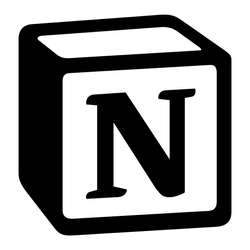

#  Notion Search Plugin for Flow Launcher

## 1. [Create your integration in Notion](https://developers.notion.com/docs/create-a-notion-integration#getting-started)

The first step to building any integration (internal or public) is to create a new integration in Notion’s integrations dashboard: [https://www.notion.com/my-integrations](https://www.notion.com/my-integrations).

1. Click + `New integration`.
2. Enter the integration name.
3. (Optional) If you're using the completed sample app with the comment form as well, update the to allow comment interactions.`Capabilities`


*Navigating the integrations dashboard to create a new internal integration.*

The integration will be internal by default. If you are building a public integration, you will need to make it public under the tab.`Distribution`

## 2. [Get your API secret](https://developers.notion.com/docs/create-a-notion-integration#get-your-api-secret)

API requests require an API secret to be successfully authenticated. Visit the tab to get your integration’s API secret (or “Internal Integration Secret”).`Secrets`


*Secrets tab in integrations dashboard.*

```
👍 Keep your API secret a secret!

Any value used to authenticate API requests should always be kept secret. Use environment variables and avoid committing sensitive data to your version control history.

If you do accidentally expose it, remember to “refresh” your secret.
```

## 3. Api Secret Setting

Settings - Plugin - Notion Search - API Secret

## 4. [Give your integration page permissions](https://developers.notion.com/docs/create-a-notion-integration#give-your-integration-page-permissions)

API requests require an API secret to be successfully authenticated. Visit the Secrets tab to get your integration’s API secret (or “Internal Integration Secret”).

To give the integration permission, you will need to:

1. Pick (or create) a Notion page.
2. Click on the ... More menu in the top-right corner of the page. `...`
3. Scroll down to .`+ Add Connections`
4. Search for your integration and select it.
5. Confirm the integration can access the page and all of its child pages.


*Give your integration permission to add a database to a page.*

Your integration can now make API requests related to this Notion page and any of its children.

If you are building a public integration, use the authorization instructions included in the Authorization guide instead.

```
🚧 If your API requests are failing, confirm you have given the integration permission to the page you are trying to update. This is a common cause of API request errors.
```

## 5. Usage

### Usage Keyword

```
ns {query}
```
